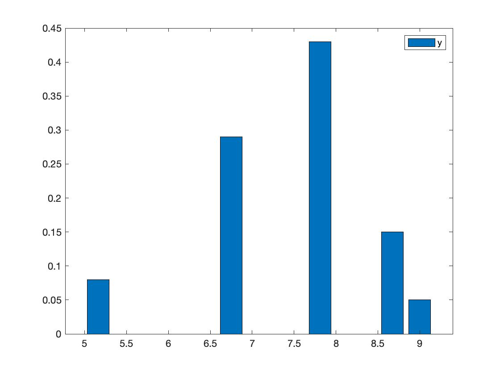
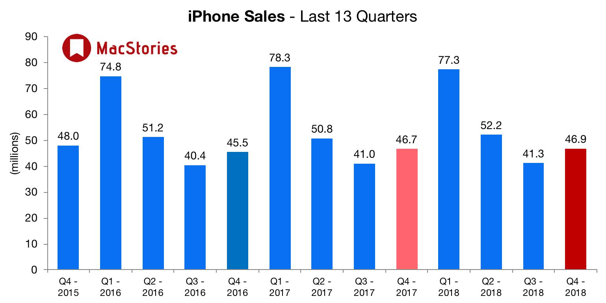
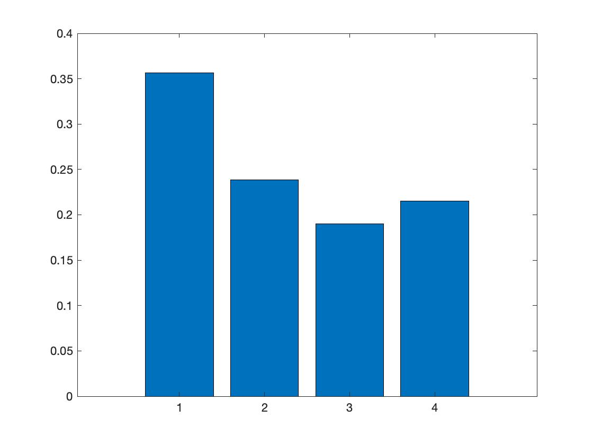
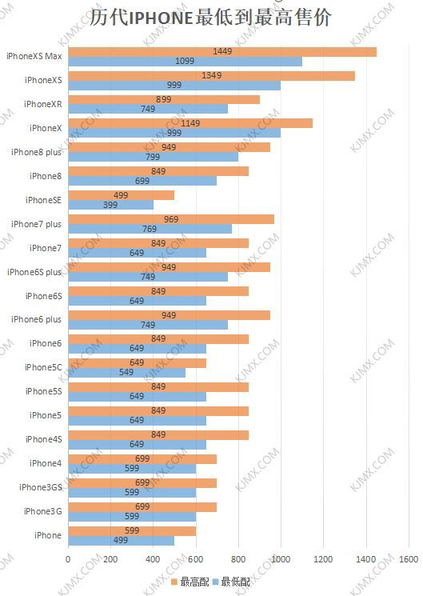
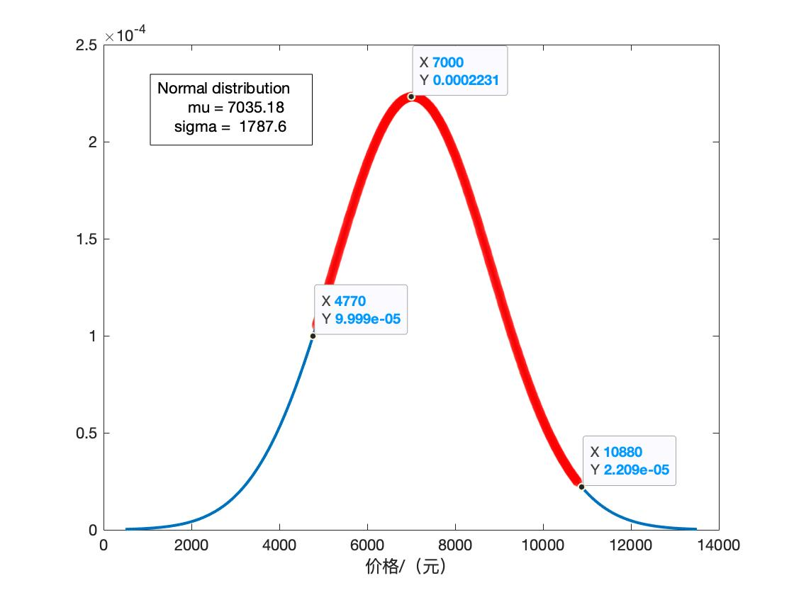

# 概率统计

运用课程知识

* 辛钦大数定律：

    * 独立同分布的n维随机序列，如果分量的期望存在，则n次观察的算数平均值会依概率收敛到它的期望

    * 当n足够大时，可将平均观察值作为期望的近似值

* 中心极限定理：

    * 独立同分布的n维随机序列，其和式在n足够大时极限分布就是正态分布

    * 可以将任意满足条件的足够长的序列看成正态分布

* 正态总体的样本均值和方差的分布

* 参数估计

## 青睐价位分布

> 京东手机月销量近80w，可以看作有足够多的样本

根据京东手机页面销售数据：手机消费者青睐的价位有如下的分布

将手机价格划分为廉价（1-349）、低（349-1362）、中（1362-3573）、高（3573-8096）、昂贵（大于8096）

取区间中间值为观测值，（最大区间用最小值近似）

174.5	855.5	2467.5	5834.5	8096

并且由于手机价格变化呈非线性变化，取价格的自然对数
X：
5.16192474164248	6.75168609333225	7.81096077130764	8.67154385124616	8.99912539152725

对应的手机消费者青睐比例为
Y：
0.08 0.29 0.43 0.15 0.05

## 苹果产品各价位机型销量

### 季度销量分布

对同一批次发布的系列产品可以根据价格和销量进行拟合分析

四季度销量呈周期性变化，且规律较为统一，因此可以对不同批次发布的产品的销量加权后进行比较。

### 各产品总销量及上市时间

19.9上市 经过2019年第四季度
iPhone 11           70      5999
iPhone 11 ProMax    12      10899
iPhone 11 Pro       13      9999

18.9上市 经过完整一年
iPhone XR           208     4899-5199-6999
iPhone Xs Max       103     7199-8999-10999
iPhone Xs           36      5399-7299-8699

折算成2018年第四季度
iPhone XR           44      6999
iPhone Xs Max       7       10999
iPhone Xs           22      8699

17.9上市 经过完整两年
iPhone 8 plus       199     4199
iPhone 8            152     3299-3999-4777

折算成2017年第四季度
iPhone 8 plus       21      6999
iPhone 8            32      4777

·       

X：
8.69934806765309	9.29642632088931	9.21024036697585	8.85352256068954	9.30555963855712	9.07096335550754	8.83913175254611	8.47156801338996

Y:
70	12	13	44	7	22	21	32

Normal distribution
       mu = 7035.18   [6798.2, 7272.16]
    sigma =  1787.6   [1635.03, 1971.82]

> 分析：产品销量随价格变化的曲线 特点

> 分析：产品价格设定在何处能获取最大利润，说明苹果定价的合理性

> 形式规范

标题 摘要 正文 参考文献（数据出处）打印a4 装订

# 智能手机产品近年来价格波动与预测

假设与检验 

几次价格整体提升的时间点：iPhone、iPhoneX
几款智能手机的价格飙升会带动整体

排序：根据品牌、利润、销量等因素进行排序

分类

预测：预测不同价位、不同品牌、不同类型智能手机短期和长期销量

[国际数据公司](https://www.idc.com/cn)

[大数据导航](https://hao.199it.com)

[IDC：温故而知新 盘点2018年国内智能手机市场](https://www.idc.com/getdoc.jsp?containerId=prCHC44855319)

[最畅销手机列表](https://zh.wikipedia.org/wiki/%E6%9C%80%E7%95%85%E9%94%80%E6%89%8B%E6%9C%BA%E5%88%97%E8%A1%A8)