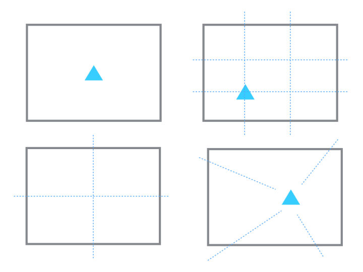

# 摄影/系统学习

## 纲要

[新手如何系统性的学习摄影？](https://www.zhihu.com/question/36095338)

[提高手机摄影水平，有什么心得？](https://www.zhihu.com/question/20921841)

> 摄影入门必备的基础知识

> ~高手们是如何去构图的~

> ~如何去拍好人像~

> ~如何拍好风光和美食~

> ~遇到瓶颈期的解决方法~

> ~拍照后期的方法和套路~

## 基础知识[侧重实践，不要太过在意参数]

### 解决曝光问题

* ~直方图：记录像素的亮度信息，其他什么都不代表。~
  * 【通道分为很多种：ＲＧＢ，红，绿，蓝，明度，颜色】
  * （明度：像素的亮度值的计算方法为：30%×R+59%×G+11%×B）
  横轴从左到右表示亮度的越高，纵轴从下到上表示像素越多。亮度从0—255。0表示黑，255表示白。
  如果某个地方的峰越高，表示在这个亮度下的像素越多。

* 快门优先，是在拍运动的东西是我们经常会用到。
  * 如果要把运动的东西凝固下来，就要用高速快门。一般1/500秒以上，
  * 如果你想要把运动的东西拍成一个运动的轨迹。那就用慢门，一般1/8秒一下。

### 点线面的观察方法

## 心得体会

提纲：
* 手机摄影几个有益的练习
    * 对一个场景多加研习:

        拍一个东西，不停地拍，不同角度，不同光线地拍

        对称、对角线、黄金分割构图，是通过什么方法实现的？颜色的获得是靠观察的挖掘，还是靠后期的调谐？一个决定瞬间，是设计场景等待而来，还是包括场景都是一瞬间的事？
        
        从技巧，到最后落到一张照片上，是需要操作流程的，我们需要反复琢磨这个流程。
    * 控制住几个关键几何位置
        

2 本人常用的几个简单技巧
3 提高手机摄影水平的几个观念性问题
